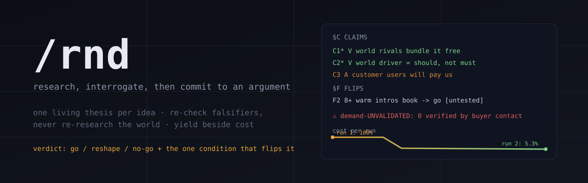
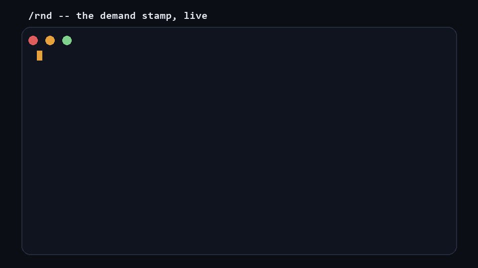

# rnd-skill

[](https://github.com/umair-tareen/rnd-skill/actions/workflows/ci.yml)





A Claude Code skill + toolkit that turns one-shot AI research into a **living,
falsifiable thesis** whose cost curves DOWN over time, and that is built to be
honest about the three ways AI research quietly lies to you.

You point it at an idea ("run R&D on X"), and it ends on one defensible
verdict: **go / reshape / no-go**, the 2-3 load-bearing claims it rests on, the
single condition that would flip it, and the cheapest test. Then it writes all
of that into a compact ledger, so the next run re-checks the falsifiers instead
of re-researching the world.

Two ways in, deliberately decoupled: **the ledger is the primitive** - four
stdlib tools + an MCP server any agent or human can drive, no methodology
required. **`/rnd` is one reference consumer** - an opinionated 4-move skill
built on top. Adopt the primitive without the process; the stamp and the
meter work the same either way.

## The three lies this is built against

**1. Re-derivation.** Most AI research is a one-shot report: expensive, then
thrown away. Ask again next month and you pay full price to rediscover a mostly
unchanged landscape. Here, run 1 populates a per-target thesis ledger; run N
loads it, re-checks only the pre-registered kill conditions, and researches
only the open questions. The committed worked example reproduces the whole
mechanism in 60 seconds: `examples/acme` is a two-run thesis where run 2
measures **9.7% of run 1** - and the meter states its own unit
(written-artifact tokens, a size proxy, NOT API spend) right in its output.
One live private target measured similarly (run 2 at ~5% of run 1, same
proxy, n=1, self-reported - treat that number as an illustration, not a
benchmark).

**2. Cheapness masquerading as efficiency.** A cost meter alone rewards
spending less, and the cheapest possible run answers nothing. So the meter
prints **yield beside cost**: claims added, how many are load-bearing, mean
confidence, and questions closed on EVIDENCE versus closed on an ASSUMPTION.
On the one live run it printed `0 load-bearing claims added` next to the cost
saving - a metric designed to make its own headline look worse. Both numbers,
always.

**3. Desk research masquerading as validation.** A research engine verifies
what a desk can reach, so a thesis drifts toward confident world-claims and
assumed customer-claims and reads as validated while nobody has tested demand.
Every claim is classed `world` / `customer` / `internal` by what kind of
evidence could ever settle it. A customer claim reaches VERIFIED only with
**typed buyer evidence** - a source prefixed `buyer:reply|call|signature|payment`;
the tool refuses a pricing comparable, an analyst note, or any free text.
While no customer claim carries such evidence, a `demand-UNVALIDATED` stamp is
derived onto the verdict line on every write: delete it by hand and the next
mutation puts it back. Be clear about the mechanism's honest limit: it is
**tamper-evident, not a lie detector**. It enforces that the buyer-contact
question is asked, in a checkable form, every time - the truth of the evidence
is the operator's. See it live in 30 seconds: `python tools/ledger.py demo`.

## What's in the box

| file | what it is |
|---|---|
| `skills/rnd/SKILL.md` | the Claude Code skill: 4 moves (FRAME, EVIDENCE, INTERROGATE, CONCLUDE + independent kill-check), lean by default |
| `SPEC.md` | the design doc: schema, recheck/diff loop, invariants V1-V13, and the bug log that earned them |
| `tools/ledger.py` | deterministic thesis bookkeeping: ids, append-only diff log, the no-source guard, the demand stamp, staleness reporting, one-file compaction |
| `tools/squeeze.py` | typed lossy compression for evidence blobs before they enter context or the ledger |
| `tools/trim.py` | the cost + yield meter: fixed vs marginal tokens, run1-vs-runN delta, evidence-vs-assumption accounting |
| `tools/state.py` | the run manifest: checkpoint every move, resume after a crash, redo (never skip) the interrupted move |
| `tools/server.py` | optional MCP server exposing all of the above as 13 tools to any MCP client |
| `ETHOS.md` | what this repo believes and why, in one file - every rule descends from it |

`ledger.py retro` turns the tool on itself: calibration (stated confidence
vs how often claims were later refuted), verdict stability, flips
pre-registered but never tested, and days since real buyer evidence. Run on
our own live thesis it reports "verdict history: reshape -> reshape ->
reshape -> reshape (never moved)" and "buyer evidence: NEVER. This thesis
has only ever been desk-checked." A tool that re-checks the world every run
and never re-checks its own record has a hole where its thesis lives.

All four tool modules are stdlib-only Python 3.10+, each with a built-in
self-test. The model supplies judgment; the tools guarantee the mechanics.

## Quickstart

```bash
# install the skill (Claude Code) -- the tools ship WITH it, not separately
mkdir -p ~/.claude/skills/rnd
cp skills/rnd/SKILL.md ~/.claude/skills/rnd/
cp -r tools ~/.claude/skills/rnd/tools

# (the repo is also a valid Claude Code plugin: .claude-plugin/plugin.json
#  passes `claude plugin validate --strict`; directory submission pending)

# the 30-second proof: the demand stamp, tampered with and restored, live
python tools/ledger.py demo

# walk the committed worked example (a full two-run thesis)
python tools/ledger.py show examples/acme/acme.md
python tools/trim.py examples/acme/run-2-recheck --thesis examples/acme/acme.md

# scaffold your own thesis; maintain it from any shell (no Claude required)
python tools/ledger.py new acme "Acme changelog tool" --out theses/acme.md
python tools/ledger.py add-claim theses/acme.md "rivals bundle it free" \
  --st V --conf 0.8 --source example.com/pricing --cls world --load-bearing
python tools/ledger.py set-open theses/acme.md Q1 --st x --closed-by C3

# what has gone unexamined? (exit 1 if anything needs attention)
python tools/ledger.py stale --dir theses

# self-tests
python tools/ledger.py selftest
python tools/squeeze.py --selftest
python tools/trim.py --self-test
python tools/state.py --self-test
```

Then, in Claude Code: `run R&D on <your idea>`.

## MCP server (optional)

The same mechanics as MCP tools, for Claude Code, Claude Desktop, Cursor, or
any MCP client. The tool modules stay stdlib-only; the server is the one
optional dependency:

```bash
pip install mcp
claude mcp add rnd -- python /absolute/path/to/tools/server.py
```

13 tools: `thesis_new` / `thesis_show` / `thesis_stale`, `claim_add` /
`claim_set`, `open_set`, `flip_set`, `verdict_set`, `diff_append`,
`thesis_compact`, `squeeze_text`, `run_measure` (cost AND yield, always
together), and `run_state` (the crash-safe run manifest). The invariants ride
along: the no-source guard, the derived demand stamp, and the
redo-never-skip resume rule are enforced server-side, not requested politely
in a prompt. Paths must be absolute in every call and this too is enforced -
a relative path is refused with the reason, because MCP servers inherit an
arbitrary working directory. The server has its own CI-run stdio test
(`tools/test_server.py`) covering the handshake and the refusal paths.

## Why the resume path is mechanical

Usage limits kill long agent runs; that is the environment, not a failure.
Most "resumable" agent designs are prose: the model is told to checkpoint and
resume, and nothing owns the file. `state.py` owns it. The property that
matters, and the one the self-test attacks: **a move interrupted mid-flight is
left WIP and gets REDONE on resume, never skipped.** Skipping it would silently
drop exactly the work the crash interrupted while still looking like a clean
resume, which is the worst available failure because it is invisible.

## Prior art, and what is actually new here

The living-claim-ledger idea has independent academic convergence, and we
went looking for it on purpose (full cited landscape, maintained as a living
thesis with these very tools: [`research/landscape.md`](research/landscape.md)):

- **ResearchLoop** ([arXiv:2605.28282](https://arxiv.org/abs/2605.28282))
  treats claim ledgers and evidence objects as durable project state - the
  closest published system. Its schema has no pre-registered falsifier field
  and claims are not re-validated across runs.
- **EviBound** ([arXiv:2511.05524](https://arxiv.org/abs/2511.05524)) gates
  agent claims behind machine-verifiable typed evidence - the same refusal
  pattern as our `buyer:` tag, applied to execution artifacts rather than
  demand.
- **POPPER** ([snap-stanford/POPPER](https://github.com/snap-stanford/POPPER))
  runs agent-designed falsification experiments with statistical error
  control - single-run, no persistent ledger.
- **HDSO** ([arXiv:2606.22330](https://arxiv.org/abs/2606.22330)) curates
  falsifiable hypotheses with validation plans, for embodied agent skills.

The buyer-contact epistemic is older still: lean-startup discipline,
practiced at scale by product-discovery platforms. What we did not find
anywhere, and claim as this repo's contribution: **cross-run re-check of
pre-registered falsifiers in a shipped tool**, the **derived, non-storable
demand stamp** on the verdict line, **typed buyer evidence** as a write-time
refusal, and a cost meter that **prints yield beside cost**. If you find
prior art for any of these, open an issue - this repo's whole premise is that
being corrected early is the win.

## The bug log is the point

`SPEC.md` §B records the defects found so far, first by turning the skill's
own interrogation ("what's the biggest concern? what am I missing?") on
itself, then by a five-persona adversarial review with an independent judge:
a mutation API that existed only in prose, a cost meter that reported 105%
when the truth was 5%, a cost meter with no yield counterweight, a resume
path that had never survived a kill, an install doc that broke the first
command, and a "tool-enforced" stamp that free text could clear. Every
invariant in the spec was earned by one of them. That is the standard the
skill holds its research targets to, so it is the standard it gets held to.

## Credits

Embeds the workings of three MIT repos by [skibidiskib](https://github.com/skibidiskib):
[ai-codex](https://github.com/skibidiskib/Ai-codex) (the compact re-read index
and its caveman FORMAT.md), [ai-squeeze](https://github.com/skibidiskib/Ai-squeeze)
(typed lossy compression), [ai-trim](https://github.com/skibidiskib/ai-trim)
(the always-loaded token-tax meter). The voice lane pairs well with
[last30days-skill](https://github.com/mvanhorn/last30days-skill) (MIT) if you
have it; it is optional.

## Honest status

- Proven: the recheck/diff loop end to end (the committed `examples/acme`
  reproduces it; one private live target measured similarly), the demand
  stamp with typed-evidence refusal, the staleness report, a mid-move kill
  resumed by a cold process in rehearsal, and the MCP server over real stdio
  JSON-RPC including its enforcement paths - all in CI on Linux and Windows.
- Not yet proven: more than one live thesis; a resume through a real mid-run
  usage-limit kill (rehearsed, not yet observed live); and adoption by anyone
  other than the author. Held to this repo's own taxonomy, "others will adopt
  this" is a customer-class claim currently at ASSUMED - it verifies the same
  way every customer claim does: on real buyer contact, not on a README.
- **Benchmarked three times, three headline nulls, all published**
  (`benchmark/`, each pre-registered before running, all raw outputs
  committed). v1: enforcement did not beat requested discipline. v2: the
  realistic unprompted baseline never fell for the demand trap - a modern
  model is already skeptical in the moment. v3 finally tested the axis only
  this tool can run - **the world changes between runs; does the assessment
  change with it?** - and the headline metric was destroyed by our own
  scorer (it punished well-cited assertions; disclosed, not retuned). What
  survived all three rounds of trying to kill it, measured every time:
  **structure** (0 ledger format failures across all rounds vs 213+14 for
  prose; 6/6 theses still machine-parseable after updates), **cost**
  (ledger recheck = 0.54x a prose rewrite, and prose updates grew ~70%
  per cycle - re-narration is O(history), recheck is O(delta)), and
  **guard integrity** (6/6 demand stamps cleared via legitimate
  buyer:signature evidence when it finally existed; zero fabricated
  evidence across 24 adversarial opportunities). So the claim this repo
  makes is exactly what was measured and nothing more: **the tool makes
  research output durable, auditable, and cheap to keep current - not
  smarter.** `benchmark/RESULTS.md`, `RESULTS-v2.md`, `RESULTS-v3-drift.md`.

## What's in the box, part 2

`examples/acme/` is a complete synthetic two-run thesis generated by the
tools themselves - the ledger after two runs, both run folders with their
crash-safe manifests, and the real meter output. `python tools/ledger.py demo`
is the 30-second live proof of the stamp.

MIT License. Portions port three MIT repos by
[skibidiskib](https://github.com/skibidiskib); their notice is reproduced in
LICENSE.
